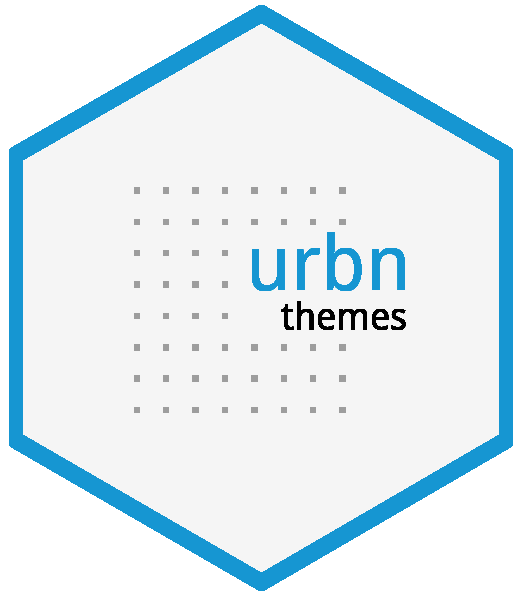

---
output:
  revealjs::revealjs_presentation:
    css: www/revealjs.css
    incremental: TRUE
    reveal_options:
      slideNumber: TRUE
      previewLinks: TRUE
editor_options:
  chunk_output_type: console
params:
  state: "Alabama"
  year: 2016    
---

```{r setup, echo = FALSE, message = FALSE, warning = FALSE}
library(knitr)
library(tidyverse)

opts_chunk$set(echo = FALSE)
opts_chunk$set(message = FALSE)
opts_chunk$set(warning = FALSE)
opts_chunk$set(fig.align = "center")
```

# <font color="#ffffff">Iterated Fact Sheets With R Markdown</font> {data-background=#1696d2}

## Iterated Fact Sheets With R Markdown

Aaron R. Williams (@awunderground)

```{r out.width = "50%"}

```

# <font color="#ffffff">Urban Institute</font> {data-background=#1696d2}

## Urban Institute

<br>
<br>

```{r out.width = "500%"}
knitr::include_graphics("www/images/urban-institute-logo.png")
```

## Who we are

> * 575 staff/300 researchers
> * 50 years

```{r out.width = "200%"}

```

## What we do

Our mission is to open minds, shape decisions, and offer solutions through economic and social policy research.

Our objective research helps expand opportunities for all, reduce hardship among the most vulnerable, and strengthen the effectiveness of the public sector.

* Tax Policy Center analysis of candidate tax plans
* Health Policy Center analysis of insurance coverage (King vs. Burwell)
* Pioneers of paired testing and microsimulation

# <font color="#ffffff">Why?</font> {data-background=#1696d2}

## <font color="#ffffff">Motivation</font> {data-background="www/images/texas.jpg"}

*<font color="#ffffff">Getting info into the</font>*

*<font color="#ffffff">right hands is important.</font>*


## <font color="#ffffff">Motivation</font> {data-background="www/images/encyclopedia.jpg"}

<br>
<br>
<br>
<br>

<font color="#ffffff">*Reports often seem like this.*</font>

## Motivation

*Our attention spans are trained for this.*

```{r out.width = "75%", echo = FALSE}
RXKCD::getXKCD(which = 539)$img
```

## Economic and social policy comic strips

## ~~Economic and social policy comic strips~~ <font color="#1696d2">Iterated fact sheets and web pages</font>

## <font color="#ffffff">What does this look like?</font> {data-background="www/images/calendar.jpg"}

### <font color="#ffffff">1. Targeted and brief for a meaningful subset</font>

## What does this look like? {data-background="www/images/usmap.png"}

### 1. Targeted and brief for a meaningful subset 

## What does this look like? {data-background="www/images/georgetown.jpg"}

### 1. Targeted and brief for a meaningful subset

## What does this look like?

### 2. Branded and visually appealing

```{r fig.show = "hold", out.width = "60%"}
knitr::include_graphics("www/images/plots.png")
```

<br>

[Urban Institute data visualization style guide](https://urbaninstitute.github.io/graphics-styleguide/)

## What does this look like?

### 2. Branded and visually appealing

<br>
<br>

```{r}

```

## What does this look like? 

### 3. Not labor intensive


# <font color="#ffffff">What?</font> {data-background=#1696d2}

## Examples

> * [State fact sheets](https://www.urban.org/policy-centers/cross-center-initiatives/low-income-working-families/projects/state-by-state-look-children-immigrants)
> * [County fact sheets](https://www.urban.org/policy-centers/health-policy-center/projects/california-county-fact-sheets-treatment-gaps-opioid-agonist-medication-assisted-therapy-oa-mat-and-estimates-how-many-additional-prescribers-are-needed)
> * [State fact pages](https://www.urban.org/policy-centers/cross-center-initiatives/state-and-local-finance-initiative/projects/state-fiscal-briefs)

# <font color="#ffffff">How?</font> {data-background=#1696d2}

## <font color="#ffffff">R</font>

```{r}
knitr::include_graphics("www/images/rlogo.png")
```

## .R Markdown

* Text and images
* Code
* Code output

## R Markdown

<iframe width="2000" height="600" src="https://rmarkdown.rstudio.com/gallery.html"></iframe>

## .Rmd

> * Text and images
> * Code
> * Code output

<br>

```{r out.width = "150%"}
include_graphics("www/images/rmarkdownflow.png")
```

[R4DS](https://r4ds.had.co.nz/r-markdown.html)

## Three ingredients for fact sheets/pages

* Data structure
* Parameterized .Rmd template
* Iterating script

## 1) Data structure

```{r echo = FALSE}
library(urbnmapr)

statedata %>%
  select(state_name, hhpop, horate, medhhincome) %>%
  filter(row_number() <= 8) %>%
  knitr::kable()
```

* Typically one row per fact sheet/page

## 2) Parameterized .Rmd template

```
---
params:
  state: "Alabama"
  year: 2016
---
```

Parameters for R Markdown documents are specified in the YAML header:


## 2) Parameterized .Rmd template

```
---
params:
  state: "Alabama"
  year: 2016
---
```

`params$state` can be used anywhere in the document as `"Alabama"`.

## 2) Parameterized .Rmd template


```
---
params:
  state: "Alabama"
  year: 2016
---
```

First, use the parameters to filter the big data structure to just data for an individual state or locality.

```{r echo = TRUE, eval = FALSE}
data <- data %>%
  filter(state == params$state)
```

## 2) Parameterized .Rmd template

```
---
params:
  state: "Alabama"
  year: 2016
---
```

Now, we can use `data$<variable>` for the state/locality specific variables and `params$<parameter>` throughout the document:

<br>

```
There were 'r data$fatalities' traffic fatalities in 'r params$state' in 'r params$year'. 
```

There were <font color="#1696d2">1,038</font> traffic fatalities in <font color="#1696d2">`r params$state`</font> in <font color="#1696d2">`r params$year`</font>.

## 2) Parameterized .Rmd template

Data viz!

```{r image_grobs, fig.show = "hold", out.width = "30%", fig.align = "default"}

knitr::include_graphics("www/images/ggplot2.png")

```

## 2) Parameterized .Rmd template

> * LaTeX for .pdf

* preamble.tex
* general document styles
* LaTeX macros
    * `urbntitle{}`
    * `urbnboilerplate{}`

## 2) Parameterized .Rmd template

> * CSS for .html
> * CSS for .md

* styles.css

## 3) Iterating script

```{r echo = TRUE, eval = FALSE}
# create a data frame with parameters and output file names
runs <- tibble(
  # creates a string with output file names in the form <index>.pdf
  output_file = str_c(index, ".html"),    
  # creates a nested list of parameters for each object in the index
  params = map(index, ~list(state = .))  
)
```

<br>

```{r, echo = TRUE, eval = FALSE}
# iterate render() along the tibble of parameters and file names
runs %>%
  pwalk(rmarkdown::render, input = "template.Rmd", output_dir = "factsheets")
```

## 3) Iterating script

TIP! Don't use `NA` in a YAML header.

```
---
params:
  state: "Alabama"
  year: 2016
---
```

## [Fact Sheet Tool](https://github.com/UrbanInstitute/rmarkdown-factsheets)

## [Fact Page Tool](https://github.com/UI-Research/rmarkdown-fact-pages)

## Overall Process

* Why fact sheets? 
* Create a Word/Google Doc template (if collaborating)
* Recreate the template for one iteration in .Rmd
* Iterate the .Rmd
* Quality control
* Create a home for the fact sheets

## Takeaways

* Visually consistent
* Accurate
* Easy to update

# <font color="#ffffff">Data\@Urban</font> {data-background=#1696d2}

## [Data\@Urban](https://medium.com/@urban_institute)

```{r}
knitr::include_graphics("www/images/data-at-urban.png")
```

* [Iterated fact sheets with R Markdown](https://medium.com/@urban_institute/iterated-fact-sheets-with-r-markdown-d685eb4eafce)
* [Iterated PDFs with R Markdown](https://medium.com/@urban_institute/iterated-pdfs-with-r-markdown-144e2a6d6a1a)

# <font color="#ffffff">Questions</font> {data-background=#1696d2}

## Reach out to me

> * awilliams@urban.org
> * @awunderground

# <font color="#ffffff">References</font> {data-background=#1696d2}

## References

Calendar - [Dafne Cholet](https://www.flickr.com/photos/dafnecholet/5374200948/in/photolist-9bUbH3-2a3hQ-5U7uqn-8QQ8K3-3qMfSb-3qMfY7-q2VEP-2WX1J-rUyG8-ciW6b-5SLjF-6hEsk-5vZnPr-6CHvXt-8Hn4jy-85Kbxu-4cUF23-ztku6-bR4TB-2hPmvTW-fTtMs-3Pk7f7-9Tjo7V-67DVkN-2hPDEez-76v1pT-2hPJZbD-7TuSV-8TQz57-7rg49R-v3TgT-v3Tiq-fsTz3-v3ThC-6CMGa9-6CMFsb-6CMGH7-aFPwXa-5yMRZk-QtpPeq-5jLKHc-cT9Bh-9Tjoap-4JxCpF-2aNjrB-E5tpq-4bHpe2-9gZGC3-5qY8AB-fkDcy)

Georgetown - [ehpien](https://www.flickr.com/photos/91499534@N00/2090429604/in/photolist-4bHZTJ-51en7R-7AXRbH-5ah6EH-x2L1bh-jBdpfA-SVmeb-rjcfi-rTb6gK-28oNSaR-SVmDE-2iXxnKy-2j2ALx2-7B2EaJ-rRigCH-o27gX-7sTHTY-CJ8FEr-2gy9vwE-518qp7-satRdq-rdCeLs-2dZgmvm-D994U-hmEzck-ecdTzh-r2zxZ1-7AXR3v-LQdd2g-dRYF7Q-6HP7ZR-AN7stw-9AKMoA-cuj6U7-9v2NNk-9HtHue-wWaCWg-khWAQt-a9ggbQ-6H7kqJ-xQJ69U-6qpmoq-9w7Nod-9jtCY9-8MK3ge-wW2MkY-92EwbP-51iyhL-5oyAf2-5hLJuD)

Texas Statehouse - [LoneStarMike](https://en.wikipedia.org/wiki/Texas_State_Capitol#/media/File:TexasStateCapitol-2010-01.JPG)

Encyclopedia - [WestportWiki](https://en.wikipedia.org/wiki/Encyclopedia#/media/File:Encyclopedia_Britannica_(crop).jpg)

R logo - [The R Foundation](https://www.r-project.org/logo/)


# <font color="#ffffff">Thank You</font> {data-background=#1696d2} 
